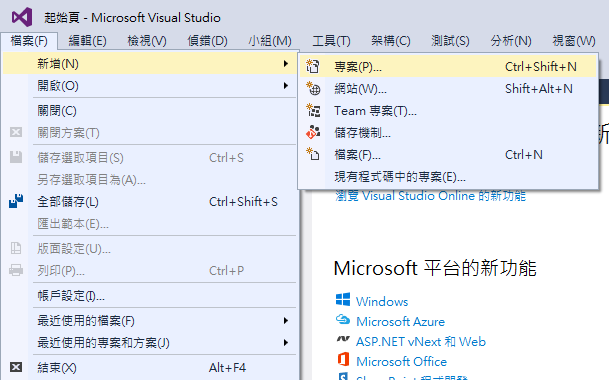
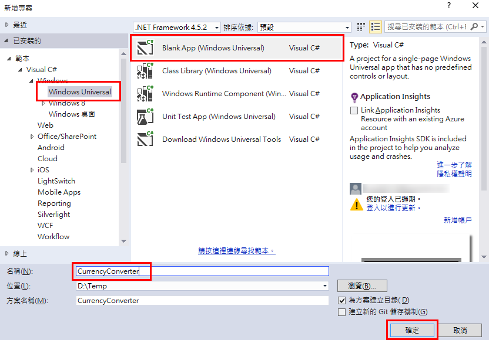
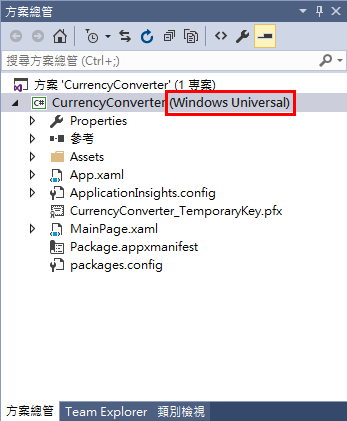
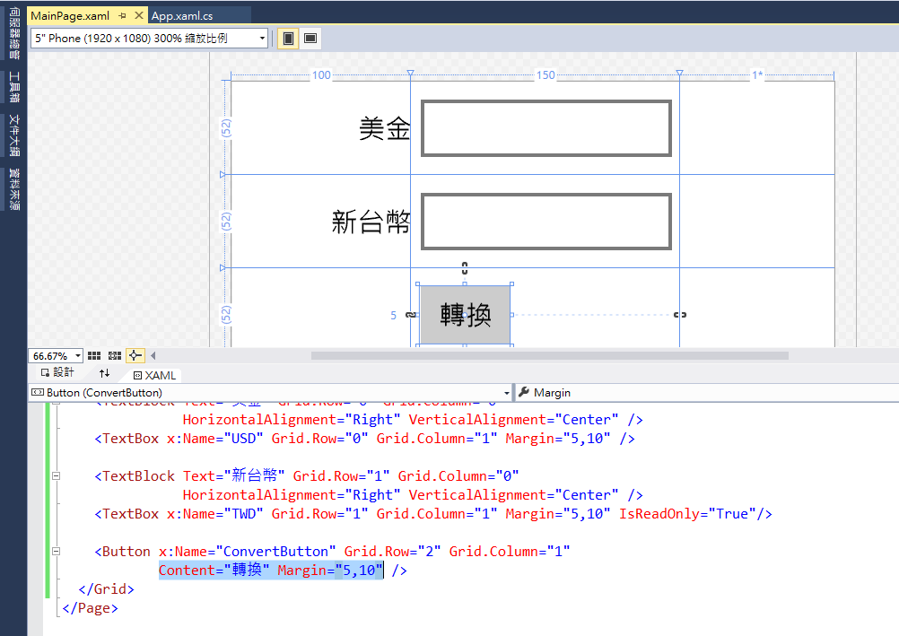
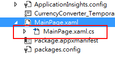
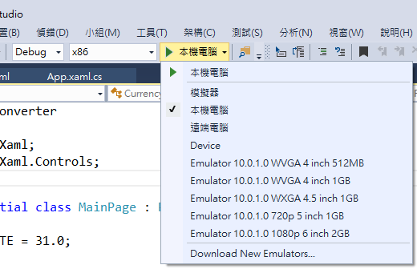
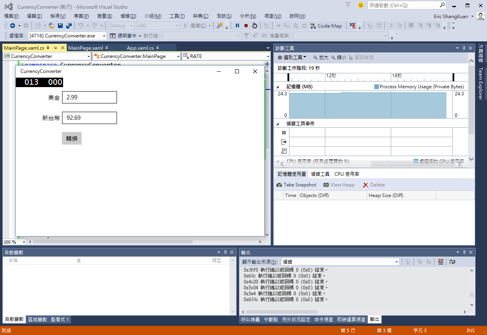
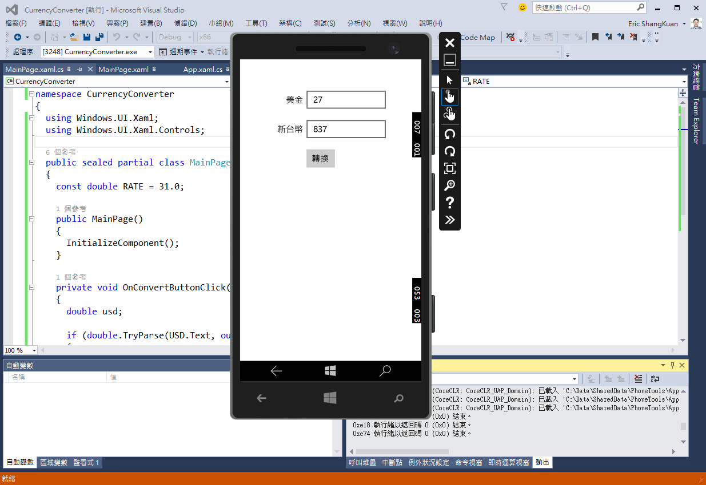

# Lab 1 - 熟悉開發工具並設計匯率轉換器

預估時間: **30 分鐘**

事前準備:
  * 安裝 [Windows 10 (Build 10130)](http://insider.windows.com)
  * 安裝 [Visual Studio 2015 RC](http://www.visualstudio.com/) 並且有勾選 Windows Tooling


## 1. 開啟 Visual Studio 2015 並新增專案

開啟 Visual Studio 2015，在啟始頁左側選擇_「新增專案...」_或是從上方功能表列選取_「檔案」_ » _「新增」_ » _「專案...」_。



在新增專案的對話視窗中，在左側的範本中選擇 _「Visual C#」_ » _「Windows」_ » _「Windows Universal」_ ，然後選擇_「Blank App (Windows Universal)」_，最後再下方的名稱處輸入專案名稱，這裡使用 _CurrencyConverter_，完成後按下_確定_按鈕開始建立專案。



專案建立完成後，你可以在右側（預設的 Visual Studio 配置）的方案總管中看到這個範本所產生的所有檔案。只要看到專案目標平台是 **Windows Universal** 就可以確定是正確的專案了。



## 2. 設計匯率轉換器的介面

在方案總管中點兩下開啟 **MainPage.xaml** 檔案，然後將下面的程式碼貼在 MainPage.xaml 中：

```xml
<Page
    x:Class="CurrencyConverter.MainPage"
    xmlns="http://schemas.microsoft.com/winfx/2006/xaml/presentation"
    xmlns:x="http://schemas.microsoft.com/winfx/2006/xaml"
    xmlns:local="using:CurrencyConverter"
    xmlns:d="http://schemas.microsoft.com/expression/blend/2008"
    xmlns:mc="http://schemas.openxmlformats.org/markup-compatibility/2006"
    mc:Ignorable="d">
    
    <Grid Background="{ThemeResource ApplicationPageBackgroundThemeBrush}" Margin="12,24">
        <Grid.RowDefinitions>
            <RowDefinition Height="Auto" />
            <RowDefinition Height="Auto" />
            <RowDefinition Height="Auto" />
            <RowDefinition Height="*" />
        </Grid.RowDefinitions>
        
        <Grid.ColumnDefinitions>
            <ColumnDefinition Width="100" />
            <ColumnDefinition Width="150" />
            <ColumnDefinition Width="*" />
        </Grid.ColumnDefinitions>
        
        <TextBlock Text="美金" Grid.Row="0" Grid.Column="0" 
                   HorizontalAlignment="Right" VerticalAlignment="Center" />
        <TextBox x:Name="USD" Grid.Row="0" Grid.Column="1" Margin="5,10" />
        
        <TextBlock Text="新台幣" Grid.Row="1" Grid.Column="0" 
                   HorizontalAlignment="Right" VerticalAlignment="Center" />
        <TextBox x:Name="TWD" Grid.Row="1" Grid.Column="1" 
                 Margin="5,10" IsReadOnly="True"/>
                 
        <Button x:Name="ConvertButton" Grid.Row="2" Grid.Column="1" 
                Content="轉換" Margin="5,10" Click="OnConvertButtonClick" />
    </Grid>
</Page>
```

貼上程式碼並儲存後，我們可以看到設計視窗中就會立刻呈現這個介面的樣子。



在這裡我們可以看到幾個重點：

  * 整個畫面使用 ```<Grid>``` 元件來做佈局，而我們使用 ```<Grid.RowDefinitions>``` 以及 ```<Grid.ColumnDefinitions>``` 兩個元件來設計表格的列高及行寬，設定完成後，以下的控制項元件便能以 ```Grid.Row``` 及 ```Grid.Column``` 屬性來指定元件擺放的位置（從 0 開始）。而在列高行寬的設定值中，可以設定絕對像素值（如：```Width="150"```）、 ```Auto``` 會根據控制項元件的大小自動調整，而 ```*``` 則是使用剩餘空間。
  
  * 元件中使用 ```x:Name``` 來指定它的名稱，這讓我們之後可以在程式中以該名稱來操作該元件。

  * ```Margin``` 是用來與其它元件設定間隔所使用的屬性，這與 Web 開發中的 CSS Margin 指定順序不同，在 XAML 中 Margin 所指定的間隔依序為「左、上、右、下」（CSS Margin 為上、右、下、左）。而與 CSS Margin 一樣的地方為，若只設定一個數值則表示四個方向都是一樣的間隔大小，設定兩個數值則是左右、上下各自相同。所以在此例中 ```Margin="5,10"``` 表示左右間隔 5，而上下都間隔 10。

  * 在 ```<Button>``` 控制項元件中，```Click``` 屬性是用來指定當按鈕被按下時再執行的函式，這個部份會在稍後的程式碼中加入

## 3. 撰寫匯率轉換的程式碼

設計好介面之後，我們還需要撰寫程式碼，你可以在開啟 **MainPage.xaml** 的狀態下按 **F7**，或是直接從方案總管點開 XAML 檔的樞紐來開啟對應的 **MainPage.xaml.cs** 檔案。



打開 code behind 的檔案後，將下列的程式碼貼上：

```csharp
namespace CurrencyConverter
{
    using Windows.UI.Xaml;
    using Windows.UI.Xaml.Controls;
    
    public sealed partial class MainPage : Page
    {
        const double RATE = 31.0;
        
        public MainPage()
        {
            InitializeComponent();
        }
        
        private void OnConvertButtonClick(object sender, RoutedEventArgs args)
        {
            double usd;
            
            if (double.TryParse(USD.Text, out usd))
            {
                TWD.Text = (usd * RATE).ToString();
            }
        }
    }
}
```

這段程式碼的重點就是在按下畫面上的轉換按鈕後，根據 XAML 上的設定會呼叫 ```OnConvertButtonClick``` 的函式，接下來就只是一個簡單的數字轉換的工作而已。

## 4. 執行及偵錯

XAML 及其 code behind 的程式碼都順利貼上沒有錯誤之後，就可以直接來執行偵錯，這可以在 Visual Studio 上方的工具列找到執行的按鈕：



如果要測試在平板或是 Windows 10 的桌面環境的執行狀況，可以選擇_模擬器_、_本機電腦_或是_遠端電腦_，來做為執行及測試的環境；而如果要在實機上測試就要選_Device (裝置)_；而目前開發工具中也包含了手機的模擬器，也就是以下 _Emulator xxxx_ 的幾個選項。如果要測試 UWP app 在各種平台上的執行狀況，可以好好利用這些模擬環境來做測試。

在桌面環境上執行的狀況：


以手機模擬器執行：


## 回顧

完成這份 Lab 您已經學會：

  1. 使用 Visual Studio 2015 建立 UWP app 開發的專案範本。
  2. 瞭解如何使用 XAML 設計操作介面、並且在 code behind 中撰寫程式碼。
  3. 能夠將程式在桌面環境以及手機模擬器中執行起來。
