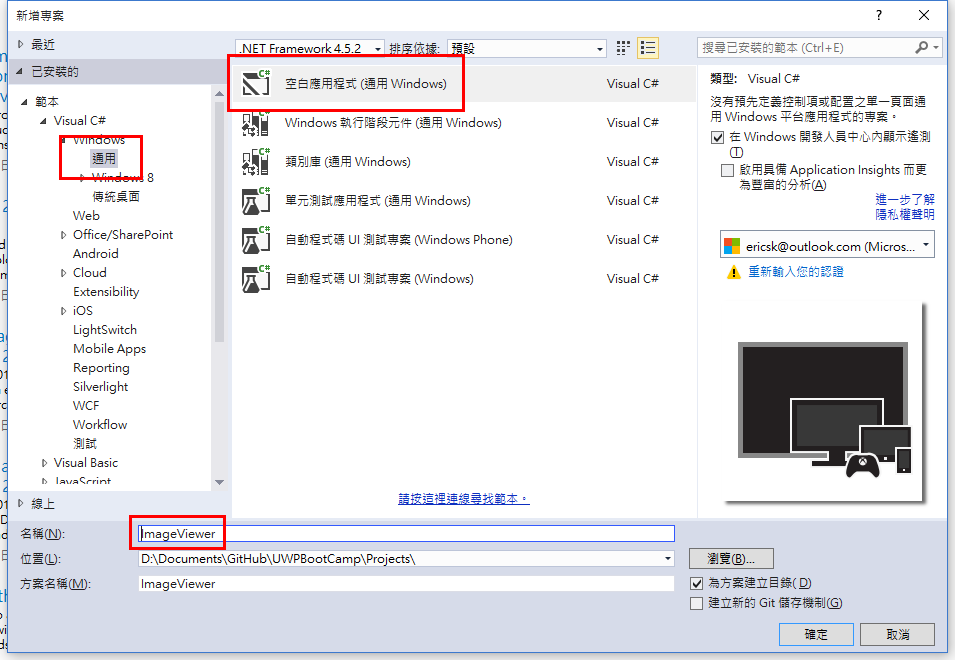
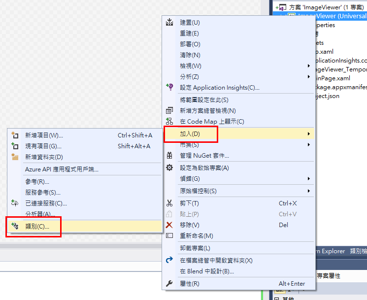
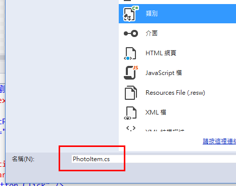
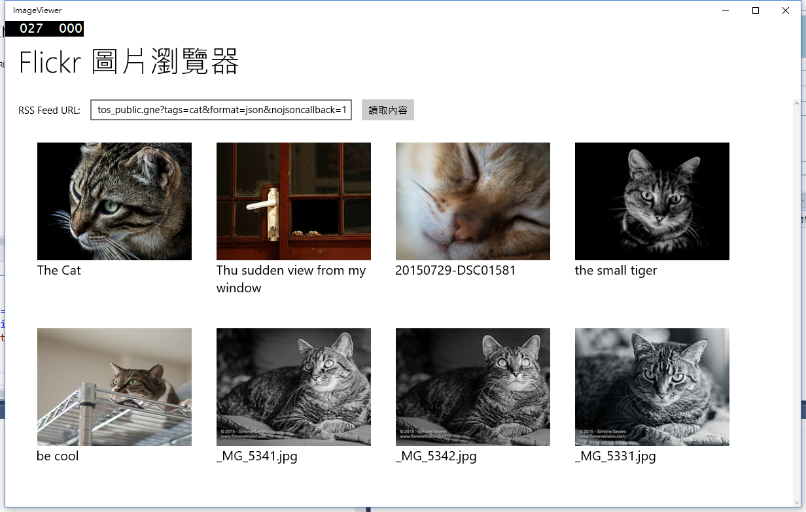

# Lab 2 - 設計圖片瀏覽器

預估時間: **30 分鐘**

## Lab 說明

這份 lab 將會一步步設計出一個透過 flickr RSS feed 然後顯示圖片的瀏覽器，我們會讓這個 app 符合自適應式設計，並且會讓您在這個 lab 的實作過程中學習到：

  * 運用 ```<GridView />``` 以及資料繫結的技巧來顯示圖片，並且透過元件範本設計來設定圖片顯示方式。
  * 使用 Web 呼叫傳送及接收資料，並且解析 JSON 格式。


## 1. 開啟 Visual Studio 2015 並新增專案

開啟 Visual Studio 2015，在啟始頁左側選擇_「新增專案...」_或是從上方功能表列選取_「檔案」_ » _「新增」_ » _「專案...」_。


在新增專案的對話視窗中，在左側的範本中選擇 _「Visual C#」_ » _「Windows」_ » _「Windows Universal」_ ，然後選擇_「Blank App (Windows Universal)」_，最後再下方的名稱處輸入專案名稱，這裡使用 _ImageViewer_，完成後按下_確定_按鈕開始建立專案。



## 2. 建立操作介面

開啟 **MainPage.xaml** 檔案，然後將程式碼修改成：

```xml
<Page
    x:Class="ImageViewer.MainPage"
    xmlns="http://schemas.microsoft.com/winfx/2006/xaml/presentation"
    xmlns:x="http://schemas.microsoft.com/winfx/2006/xaml"
    xmlns:local="using:ImageViewer"
    xmlns:d="http://schemas.microsoft.com/expression/blend/2008"
    xmlns:mc="http://schemas.openxmlformats.org/markup-compatibility/2006"
    mc:Ignorable="d">

  <Page.Resources>
    <DataTemplate x:Key="PhotoGridViewTemplate">
      <Border Height="260" Width="260" Margin="5,10,5,10">
        <StackPanel Margin="12">
          <Image Source="{Binding PhotoUrl}" Stretch="UniformToFill" Height="180" />
          <TextBlock Text="{Binding Title}" Style="{StaticResource SubtitleTextBlockStyle}" />
        </StackPanel>
      </Border>
    </DataTemplate>
  </Page.Resources>


  <Grid Background="{ThemeResource ApplicationPageBackgroundThemeBrush}">
    <Grid.RowDefinitions>
      <RowDefinition Height="120" />
      <RowDefinition Height="*" />
    </Grid.RowDefinitions>

    <TextBlock Grid.Row="0" Text="Flickr 圖片瀏覽器" VerticalAlignment="Center" 
               Style="{StaticResource HeaderTextBlockStyle}" Margin="24,0" />

    <ScrollViewer Grid.Row="1" x:Name="ContentPanel" 
                  VerticalScrollBarVisibility="Auto" VerticalScrollMode="Auto">
      <StackPanel Margin="20,0">
        <StackPanel Orientation="Horizontal">
          <TextBlock Text="RSS Feed URL:" VerticalAlignment="Center" />
          <TextBox x:Name="Url" Width="400" Margin="15,0,15,0"/>
          <Button Content="讀取內容" Click="Button_Click" />
        </StackPanel>
        <GridView x:Name="PhotoGrid" Margin="12" ItemsSource="{Binding Photos}"
                  IsItemClickEnabled="True"
                  ItemClick="PhotoGrid_ItemClick"
                  ItemTemplate="{StaticResource PhotoGridViewTemplate}"/>
      </StackPanel>
    </ScrollViewer>
  </Grid>
</Page>

```

以下簡單說明這個操作元件的設計方式。

### 基本佈局

先看到主畫面的結構，在最外層我們使用 ```<Grid />``` 元件來做基礎的排版工具，這裡運用 ```RowDefinitions``` 來定義列的高度，第一列設了高度 120 來放標題，而第二列則運用其餘空間放操作介面及顯示圖片的區域：

```xml
<Grid Background="{ThemeResource ApplicationPageBackgroundThemeBrush}">
  <Grid.RowDefinitions>
    <RowDefinition Height="120" />
    <RowDefinition Height="*" />
  </Grid.RowDefinitions>

  <TextBlock Grid.Row="0" ... />

  <ScrollViewer Grid.Row="1" ...>
    ...
  </ScrollViewer>
</Grid>
```

在標題列中，我們使用了 ```Style={StaticResource HeaderTextBlockStyle}``` 這個預設的樣式來設定標題樣式。而其餘空間則用 ```<ScrollViewer />``` 元件來確保內容超過視窗大小時會出現捲軸來瀏覽。

### GridView 及項目範本

在 ```<ScrollViewer />``` 中，除了一個文字輸入框來做 RSS Feed 的輸入之外，就是用 ```<GridView />``` 元件來顯示圖片，這裡您會發現只定義了一個 ```<GridView />``` 的元件，那圖片顯示的介面要在哪裡定義呢？注意 ```<GridView />``` 中有一個屬性是 ```ItemTemplate``` 這裡就是**指定在 GridView 下的每一個項目要如何呈現**，所以在這個 XAML 中我們在 ```<Page.Resources>``` 中定義了一個 ```<DataTemplate />``` 就是要用在這裡，所以在 GridView 中的每一個元素都會以這裡設計的介面來顯示。

## 3. 建立圖片的資料結構以及 MainPage 這一頁的 ViewModel

### 圖片的資料結構

首先建立一個物件類別來表示圖片的資料結構，所以在專案上按右鍵，然後選擇 _「加入」_ » _「類別」_...



然後類別名稱輸入 _PhotoItem.cs_



建立後，將 **PhotoItem.cs** 檔案的內容修改如下：

```csharp
namespace ImageViewer
{
  public class PhotoItem
  {
    public string Link { get; set; }
    public string PhotoUrl { get; set; }
    public string Title { get; set; }
  }
}
```

其中 ```Link``` 是照片原始的網頁位置、```PhotoUrl``` 是相片的連結、而 ```Title``` 是標題。

### MainPage 頁面的 View Model

接下來，我們要建立一個類別來作為 **MainPage.xaml** 頁面的 view model，跟上面提到的步驟一樣，在專案中加入類別，然後這次將類別名稱設定為 _MainViewModel.cs_，然後再將它的內容修改成：

```csharp
using System;
using System.Collections.ObjectModel;
using System.ComponentModel;
using System.Threading.Tasks;
using Windows.Data.Json;
using Windows.Web.Http;
using Windows.Web.Http.Filters;

namespace ImageViewer
{
  public class MainViewModel : INotifyPropertyChanged
  {
    public ObservableCollection<PhotoItem> Photos { get; private set; }

    public MainViewModel()
    {
      Photos = new ObservableCollection<PhotoItem>();
    }

    public async Task LoadFlickrPhotosAsync(string feedUrl)
    {
      Photos.Clear();

      var filter = new HttpBaseProtocolFilter();
      var client = new HttpClient(filter);
      var respText = await client.GetStringAsync(new Uri(feedUrl));

      // safe check
      respText = respText.Replace("\'", "\\'");

      // process respText
      JsonObject jsonObject = JsonObject.Parse(respText);
      JsonArray jsonArray = jsonObject["items"].GetArray();

      foreach (JsonValue val in jsonArray)
      {
        JsonObject item = val.GetObject();

        Photos.Add(new PhotoItem()
        {
          Title = item["title"].GetString(),
          Link = item["link"].GetString(),
          PhotoUrl = item["media"].GetObject()["m"].GetString()
        });

      }
    }

    public event PropertyChangedEventHandler PropertyChanged;
    private void NotifyPropertyChanged(String propertyName)
    {
      PropertyChangedEventHandler handler = PropertyChanged;
      if (null != handler)
      {
        handler(this, new PropertyChangedEventArgs(propertyName));
      }
    }
  }
}
```

#### 通知內容

首先我們看到這個類別實作 ```INotifyPropertyChanged``` 介面，幾乎絕大多數的 view model 都需要這麼做，因為**要在內部資料改變時，主動通知頁面更新內容**，所以我們的 view model 基本框架就有了這些東西，就是要能主動通知綁定的 XAML 檔。

```csharp
public class MainViewModel : INotifyPropertyChanged
{
  ...

  public event PropertyChangedEventHandler PropertyChanged;
  private void NotifyPropertyChanged(String propertyName)
  {
    PropertyChangedEventHandler handler = PropertyChanged;
    if (null != handler)
    {
      handler(this, new PropertyChangedEventArgs(propertyName));
    }
  }
}
```

而在 **MainPage.xaml** 中，我們主要會經由 view model 來顯示的是圖片集合，所以我們在這個 view model 中就用一個集合的資料結構來儲存圖片資訊，為了能自動通知介面更新，這裡使用的就是 ```ObservableCollection``` 來做處理，這樣就不必再另外通知介面刷新。

#### 讀取 RSS Feed

在這個 view model 中我們定義了一個 ```LoadFlickrPhotosAsync``` 方法，由它來主要讀取 URL 的內容，然後取回 JSON 字串，再解析字串的內容並把資料填入 ```Photos``` 中，以完成資料對應。

## 4. 回到 MainPage.xaml.cs

前面我們設計了 **MainPage.xaml** 頁面的操作介面，現在來修改它的 code behind 讓它真的能動，打開 **MainPage.xaml.cs** 然後將內容修改為：

```csharp
using System;
using Windows.System;
using Windows.UI.Xaml;
using Windows.UI.Xaml.Controls;

namespace ImageViewer
{
  public sealed partial class MainPage : Page
  {
    private MainViewModel viewModel;

    public MainPage()
    {
      this.InitializeComponent();
      viewModel = new MainViewModel();
      DataContext = viewModel;
    }

    private async void Button_Click(object sender, RoutedEventArgs e)
    {
      Url.IsEnabled = false;
      await viewModel.LoadFlickrPhotosAsync(Url.Text);
      Url.IsEnabled = true;
    }

    private async void PhotoGrid_ItemClick(object sender, ItemClickEventArgs e)
    {
      var item = e.ClickedItem as PhotoItem;
      await Launcher.LaunchUriAsync(new Uri(item.Link));
    }
  }
}
```

### 綁定 View Model

在這個類別的建構式中，我們建立了一個 ```MainViewModel``` 的物件，然後把它設定給 ```DataContext```，這樣便完成了 view model 的綁定。

### 讀取按鈕的操作

在 **MainPage.xaml** 中定義了按鈕的處理函式是 _Button\_Click_，所以在 code behind 中定義這個函式來處理讀取 RSS Feed 的操作，所以這裡就透過 view model 去呼叫 ```LoadFlickrPhotosAsync``` 方法來讀取圖片。

### GridView 中按下圖片的操作

在 **MainPage.xaml** 中的 ```<GridView />``` 元件定義了 ```IsItemClickEnabled="True"``` 以及 ```ItemClick="PhotoGrid_ItemClick"``` 的屬性，所以這裡就用 ```PhotoGrid_ItemClick``` 來處理按下後的操作 -- 根據圖片的 ```Link``` 來打開原始網址。

## 5. 執行

啟動 app 後，在 URL 列填入 _https://api.flickr.com/services/feeds/photos_public.gne?tags=cat&format=json&nojsoncallback=1_ 或是 _https://api.flickr.com/services/feeds/photos_public.gne?tags=dog&format=json&nojsoncallback=1_ 按下讀取按鈕，就可以看到圖片呈現了。

