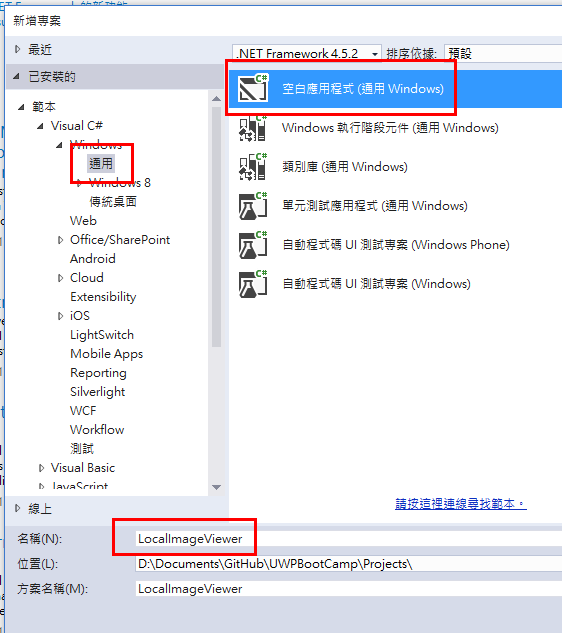
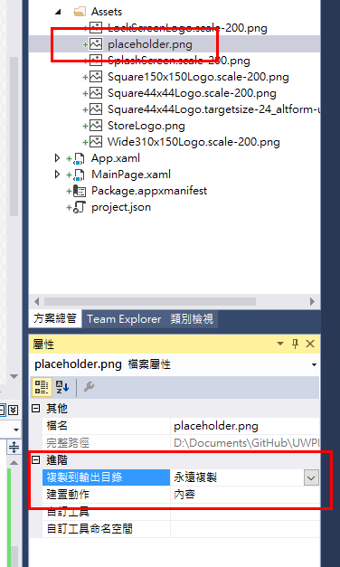

# Lab 3 - 讀取用戶的圖片瀏覽器

預估時間: **30 分鐘**

## Lab 說明

透過這份 Lab 瞭解如何存取 App 套件內的檔案，以及使用 FileOpenPicker 讓用戶選擇要存取的檔案。

## 1. 開啟 Visual Studio 20015 並建立新專案

開啟 Visual Studio 2015，在啟始頁左側選擇_「新增專案...」_或是從上方功能表列選取_「檔案」_ » _「新增」_ » _「專案...」_。


在新增專案的對話視窗中，在左側的範本中選擇 _「Visual C#」_ » _「Windows」_ » _「Windows Universal」_ ，然後選擇_「Blank App (Windows Universal)」_，最後再下方的名稱處輸入專案名稱，這裡使用 _LocalImageViewer_，完成後按下_確定_按鈕開始建立專案。



## 2. 設定操作介面

打開 **MainPage.xaml** 檔案，將 XAML 檔案內容修改為：

```xml
<Page
    x:Class="LocalImageViewer.MainPage"
    xmlns="http://schemas.microsoft.com/winfx/2006/xaml/presentation"
    xmlns:x="http://schemas.microsoft.com/winfx/2006/xaml"
    xmlns:local="using:LocalImageViewer"
    xmlns:d="http://schemas.microsoft.com/expression/blend/2008"
    xmlns:mc="http://schemas.openxmlformats.org/markup-compatibility/2006"
    mc:Ignorable="d">

  <Grid Background="{ThemeResource ApplicationPageBackgroundThemeBrush}">
    <Grid.RowDefinitions>
      <RowDefinition Height="120" />
      <RowDefinition Height="*" />
    </Grid.RowDefinitions>

    <TextBlock Grid.Row="0" Text="圖片瀏覽器" VerticalAlignment="Center" 
               Style="{StaticResource HeaderTextBlockStyle}" Margin="20" />

    <ScrollViewer Grid.Row="1">
      <StackPanel Margin="20, 0">
        <Button x:Name="OpenFileButton" Content="開啟檔案" Click="OpenFileButtonClicked" />

        <Image x:Name="ImageTarget" Stretch="UniformToFill" Margin="0,20" />
      </StackPanel>
    </ScrollViewer>

  </Grid>
</Page>
```

操作介面很簡單，就是一個按鈕讓使用者選擇要用什麼檔案來顯示，而 ```<Image />``` 元件就是用來顯示圖片使用的。

## 3. 將 Placeholder 圖片放入專案內

下載 [Placeholder 圖片](images/placeholder.png)，然後放在專案內的 **Assets** 目錄下，記得在屬性設定中，將**複製到輸出目錄**設定成_永遠複製_、**建置動作**設成_內容_。



## 4. 在程式啟動時套上 Placeholder 圖片

打開 **MainPage.xaml.cs** 檔案，然後在建構式加入 ```Loaded``` 事件，並且在這事件的處理函式中讀取 placeholder 圖片然後放在 ```<Image />``` 元件上。

```csharp
public MainPage()
{
  this.InitializeComponent();

  Loaded += MainPage_Loaded;
}

private async void MainPage_Loaded(object sender, RoutedEventArgs e)
{
  var file = await StorageFile.GetFileFromApplicationUriAsync(new Uri(@"ms-appx:///Assets/placeholder.png"));
  using (var stream = await file.OpenAsync(FileAccessMode.Read))
  {
    var bitmap = new BitmapImage();
    await bitmap.SetSourceAsync(stream);
    ImageTarget.Source = bitmap;
  }
}
```

在這裡我們可以看到如何使用 ```ms-appx:///``` 的 URI 形式來存取在 app 套件中的檔案。

## 5. 讓使用者選擇檔案

同樣地，我們在 **MainPage.xaml.cs** 檔案中加入畫面中按鈕的處理函式，並且在裡面使用 ```FileOpenPicker``` API 來讓使用者自行選擇圖片（副檔名為 jpg 的圖片）來顯示。

```csharp
private async void OpenFileButtonClicked(object sender, RoutedEventArgs args)
{
  FileOpenPicker picker = new FileOpenPicker();
  picker.ViewMode = PickerViewMode.Thumbnail;
  picker.SuggestedStartLocation = PickerLocationId.PicturesLibrary;

  picker.FileTypeFilter.Add(".jpg");

  StorageFile file = await picker.PickSingleFileAsync();
  if (file != null)
  {
    using (var stream = await file.OpenAsync(FileAccessMode.Read))
    {
      var bitmap = new BitmapImage();
      await bitmap.SetSourceAsync(stream);
      ImageTarget.Source = bitmap;
    }
  }
}
```

這裡我們使用 ```FileOpenPicker``` 物件，讓它以縮圖方式呈現檔案、建議從用戶的圖片目錄開始，然後在 ```FileTypeFilter``` 加上 ```.jpg``` 的描述，讓選擇檔案的對話盒只會顯示副檔名是 .jpg 結尾的檔案，取得檔案後就可以打開套用在 ```<Image />``` 元件上。

所以完整的 ```MainPage.xaml.cs``` 檔案會像是這樣：

```csharp
using System;
using Windows.Storage;
using Windows.Storage.Pickers;
using Windows.UI.Xaml;
using Windows.UI.Xaml.Controls;
using Windows.UI.Xaml.Media.Imaging;

namespace LocalImageViewer
{
  /// <summary>
  /// 可以在本身使用或巡覽至框架內的空白頁面。
  /// </summary>
  public sealed partial class MainPage : Page
  {
    public MainPage()
    {
      this.InitializeComponent();

      Loaded += MainPage_Loaded;
    }

    private async void MainPage_Loaded(object sender, RoutedEventArgs e)
    {
      var file = await StorageFile.GetFileFromApplicationUriAsync(new Uri(@"ms-appx:///Assets/placeholder.png"));
      using (var stream = await file.OpenAsync(FileAccessMode.Read))
      {
        var bitmap = new BitmapImage();
        await bitmap.SetSourceAsync(stream);
        ImageTarget.Source = bitmap;
      }
    }

    private async void OpenFileButtonClicked(object sender, RoutedEventArgs args)
    {
      FileOpenPicker picker = new FileOpenPicker();
      picker.ViewMode = PickerViewMode.Thumbnail;
      picker.SuggestedStartLocation = PickerLocationId.PicturesLibrary;

      picker.FileTypeFilter.Add(".jpg");

      StorageFile file = await picker.PickSingleFileAsync();
      if (file != null)
      {
        using (var stream = await file.OpenAsync(FileAccessMode.Read))
        {
          var bitmap = new BitmapImage();
          await bitmap.SetSourceAsync(stream);
          ImageTarget.Source = bitmap;
        }
      }
    }
  }
}
```