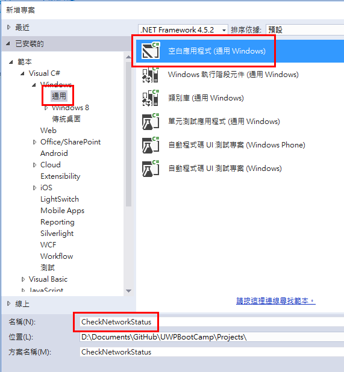
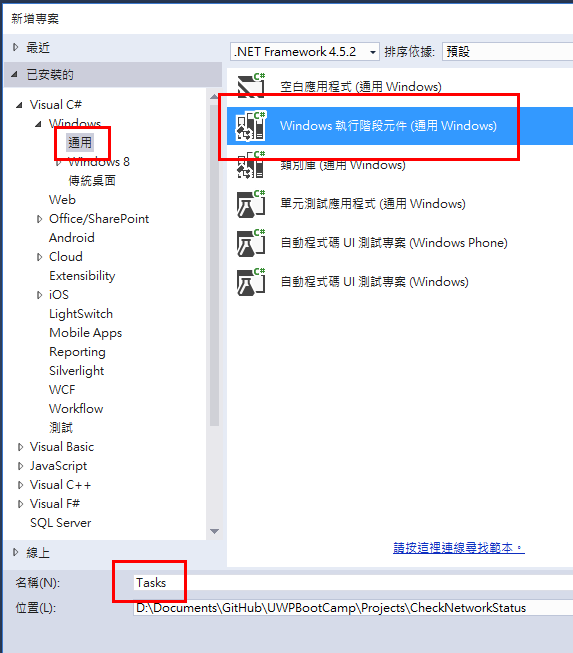
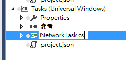
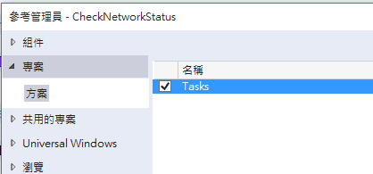
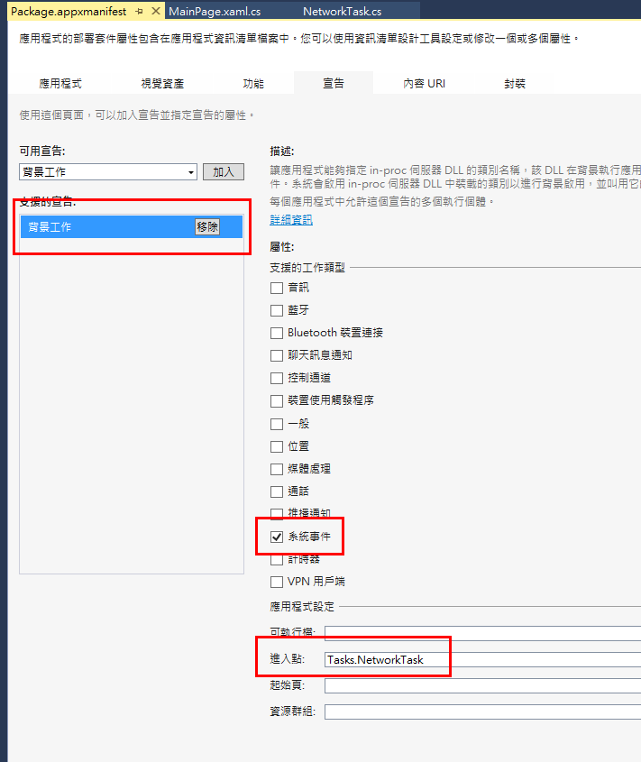

# Lab 4 - 背景檢查網路狀態是否異常

預估時間: **30 分鐘**

## Lab 說明

透過這份 Lab 瞭解如何建立背景工作，以及如何喚醒它。

## 1. 開啟 Visual Studio 20015 並建立新專案

開啟 Visual Studio 2015，在啟始頁左側選擇_「新增專案...」_或是從上方功能表列選取_「檔案」_ » _「新增」_ » _「專案...」_。


在新增專案的對話視窗中，在左側的範本中選擇 _「Visual C#」_ » _「Windows」_ » _「通用」_ ，然後選擇_「空白應用程式 (通用 Windows)」_，最後再下方的名稱處輸入專案名稱，這裡使用 _CheckNetworkStatus_，完成後按下_確定_按鈕開始建立專案。



## 2. 建立操作界面

在這個案例裡，操作界面僅需要兩個按鈕，分別為：_註冊背景工作_以及_取消註冊背景工作_。

開啟 **MainPage.xaml** 檔案，然後將 XAML 內容修改為：

```xml
<Page
    x:Class="CheckNetworkStatus.MainPage"
    xmlns="http://schemas.microsoft.com/winfx/2006/xaml/presentation"
    xmlns:x="http://schemas.microsoft.com/winfx/2006/xaml"
    xmlns:local="using:CheckNetworkStatus"
    xmlns:d="http://schemas.microsoft.com/expression/blend/2008"
    xmlns:mc="http://schemas.openxmlformats.org/markup-compatibility/2006"
    mc:Ignorable="d">

  <Grid Background="{ThemeResource ApplicationPageBackgroundThemeBrush}">
    <StackPanel Margin="20" Orientation="Horizontal">
      <Button x:Name="Register" Content="註冊背景工作" Margin="0,0,10,0" Click="Register_Click"/>
      <Button x:Name="Unregister" Content="取消背景工作" Click="Unregister_Click"/>
    </StackPanel>
  </Grid>
</Page>
```

## 3. 建立背景工作專案

在**方案總管**中，於最上方**方案**的地方按右鍵，選擇 _「加入」_ » _「新增專案」_，然後選擇 _「Visual C#」_ » _「Windows」_ » _「通用」_ » _「Windows 執行階段元件 (通用 Windows)」_，再於下方的名稱打 _Tasks_，完成後按下_確定_開始建立專案。



接著，將預設建立的 _Class1.cs_ 重新命名為 _NetworkTask.cs_，然後按照 IDE 的建議修改參考。



開啟 **NetworkTask.cs** 檔，將程式碼修改為：

```csharp
using System.Diagnostics;
using Windows.ApplicationModel.Background;
using Windows.Networking.Connectivity;

namespace Tasks
{
  public sealed class NetworkTask : IBackgroundTask
  {
    BackgroundTaskDeferral _deferral = null;

    public void Run(IBackgroundTaskInstance taskInstance)
    {
      Debug.WriteLine("Background " + taskInstance.Task.Name + " Starting...");

      taskInstance.Canceled += new BackgroundTaskCanceledEventHandler(OnCanceled);

      _deferral = taskInstance.GetDeferral();

      ConnectionProfile InternetConnectionProfile = NetworkInformation.GetInternetConnectionProfile();

      var settings = Windows.Storage.ApplicationData.Current.LocalSettings;
      var status = "";
      switch (InternetConnectionProfile.GetNetworkConnectivityLevel())
      {
        case NetworkConnectivityLevel.None:
          status = "無連線";
          break;
        case NetworkConnectivityLevel.LocalAccess:
          status = "本地連線";
          break;
        case NetworkConnectivityLevel.ConstrainedInternetAccess:
          status = "受限的連線";
          break;
        case NetworkConnectivityLevel.InternetAccess:
          status = "網際網路連線";
          break;
      }
      settings.Values["NetworkStatus"] = status;

      _deferral.Complete();
    }

    private void OnCanceled(IBackgroundTaskInstance sender, BackgroundTaskCancellationReason reason)
    {
      Debug.WriteLine("Background " + sender.Task.Name + " Cancel Requested...");
    }
  }
}
```

完成後，回到 **CheckNetworkStatus** 專案下，在_參考_的地方按下右鍵選擇_「加入參考...」_，然後把 _Tasks_ 專案加入。



## 4. 建立並啟用背景工作

打開 **CheckNetworkStatus** 專案下的 **MainPage.xaml.cs** 檔案，首先是註冊背景事件的按鈕，加入以下方法：

```csharp
private void Register_Click(object sender, RoutedEventArgs e)
{
  var builder = new BackgroundTaskBuilder();
  builder.Name = "NetworkTask";
  builder.TaskEntryPoint = "Tasks.NetworkTask";
  builder.SetTrigger(new SystemTrigger(SystemTriggerType.NetworkStateChange, false));

  BackgroundTaskRegistration task = builder.Register();

  Register.IsEnabled = false;
  Unregister.IsEnabled = true;

  task.Completed += new BackgroundTaskCompletedEventHandler(Task_Completed);
}

private void Task_Completed(BackgroundTaskRegistration sender, BackgroundTaskCompletedEventArgs args)
{
  var settings = Windows.Storage.ApplicationData.Current.LocalSettings;

  Debug.WriteLine(settings.Values["NetworkStatus"]);
}
```

這裡使用 ```BackgroundTaskBuilder``` 來建立背景工作，設定好**工作名稱**以及**工作進入點**就可以向系統註冊了。

而取消註冊背景工作的按鈕的部份，請加入下面的方法：

```csharp
private void Unregister_Click(object sender, RoutedEventArgs e)
{
  foreach (var cur in BackgroundTaskRegistration.AllTasks)
  {
    if (cur.Value.Name == "NetworkTask")
    {
      cur.Value.Unregister(true);
      Register.IsEnabled = true;
      Unregister.IsEnabled = false;
      break;
    }
  }
}
```

把所有背景工作掃一遍，發現名字是 ```NetworkTask``` 的就把它取消註冊。

所以加上程式進入時的狀態檢查，最後完整的 **MainPage.xaml.cs** 檔案內容為： 

```csharp
using System.Diagnostics;
using Windows.ApplicationModel.Background;
using Windows.UI.Xaml;
using Windows.UI.Xaml.Controls;
using Windows.UI.Xaml.Navigation;

namespace CheckNetworkStatus
{
  public sealed partial class MainPage : Page
  {
    bool registered = false;

    public MainPage()
    {
      this.InitializeComponent();
    }

    protected override void OnNavigatedTo(NavigationEventArgs e)
    {
      foreach (var task in BackgroundTaskRegistration.AllTasks)
      {
        if (task.Value.Name == "NetworkTask")
        {
          task.Value.Completed += new BackgroundTaskCompletedEventHandler(Task_Completed);
          registered = true;
          break;
        }
      }

      Register.IsEnabled = !registered;
      Unregister.IsEnabled = registered;
    }


    private void Register_Click(object sender, RoutedEventArgs e)
    {
      var builder = new BackgroundTaskBuilder();
      builder.Name = "NetworkTask";
      builder.TaskEntryPoint = "Tasks.NetworkTask";
      builder.SetTrigger(new SystemTrigger(SystemTriggerType.NetworkStateChange, false));

      BackgroundTaskRegistration task = builder.Register();

      Register.IsEnabled = false;
      Unregister.IsEnabled = true;

      task.Completed += new BackgroundTaskCompletedEventHandler(Task_Completed);
    }

    private void Task_Completed(BackgroundTaskRegistration sender, BackgroundTaskCompletedEventArgs args)
    {
      var settings = Windows.Storage.ApplicationData.Current.LocalSettings;

      Debug.WriteLine(settings.Values["NetworkStatus"]);
    }

    private void Unregister_Click(object sender, RoutedEventArgs e)
    {
      foreach (var cur in BackgroundTaskRegistration.AllTasks)
      {
        if (cur.Value.Name == "NetworkTask")
        {
          cur.Value.Unregister(true);
          Register.IsEnabled = true;
          Unregister.IsEnabled = false;
          break;
        }
      }
    }
  }
}
```

## 5. 宣告背景工作

如果少了這一步，那就沒辦法註冊及觸發背景工作了，所以這時要開啟專案中的 **Package.appxmanifest** 檔案，然後在**宣告**的部份加入背景工作的設定：



若是編輯 **Package.appxmanifest** 的 XML 檔案，找到 ```<Extensions>``` 標籤處，加上一個 extension：

```xml
<Extensions>
  <Extension Category="windows.backgroundTasks" EntryPoint="Tasks.NetworkTask">
    <BackgroundTasks>
      <Task Type="systemEvent" />
    </BackgroundTasks>
  </Extension>
</Extensions>
```

## 6. 執行

將程式執行起來後，按下註冊背景工作的按鈕，再將網路關閉，這時候就會發現背景工作就會開始做事了。